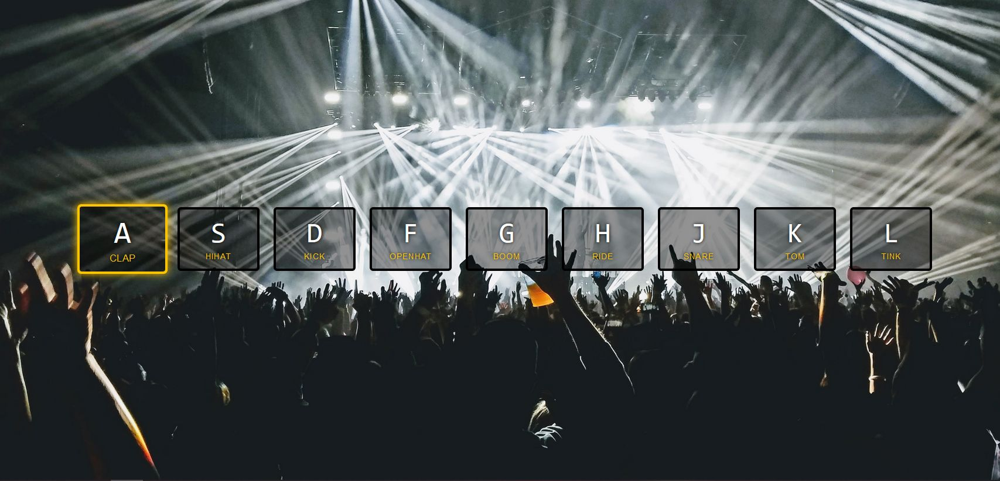

# Project Name
JS-Exercise-01-JavaScript-Drum-Kit

## Table of contents

  - [Overview](#overview)
  - [Screenshot](#screenshot)
  - [Links](#links)
  - [My process](#my-process)
  - [Built with](#built-with)
  - [What I learned](#what-i-learned)
  - [Continued development](#continued-development)
  - [Useful resources](#useful-resources)
  - [Author](#author)

## Overview

1st exercise on the code challenge page javascript30.com .

Complete the JS for the given template, to make sounds on pressing specific buttons and add a styling effect.

### Screenshot

.

### Links

- Solution URL: [https://github.com/colognia/JS-Exercise-01-JavaScript-Drum-Kit]
- Live Site URL: [https://colognia.github.io/JS-Exercise-01-JavaScript-Drum-Kit/]

## My process

- targeting the key elements in html
- targeting the audio elements
- making a switch/case condition to play sounds
- improving the key stroke processing by targeting audios thru a single variable
- adding a styling effect on key press
- adding a condition for removing the styling effect after execution

### Built with

- vanilla JS, HTML was given
- editor: visual studio code

### What I learned

First I tried to process the event thru a click event, which was wrong and not working. Then I understood I have to target the keydown event.
Targetig tags thru custom attributes was new to me, as an additional problem the attributes have a hyphen, so adresssing was more complicated.
The first approach by processing the key events thru switch/case was of course too long, so later figured out how to adress all audios thru one variable.
Secondly how to remove the animation effect was not obvious to me, because a delay is desired to see the animation.

### Continued development

Learning more about DOM manipulation.

### Useful resources

stackoverflow, W3schools, MDN, bing AI chat.

## Authors

Frauke Schmidt:
- Linkedin - (https://www.linkedin.com/in/frauke-s-395242201/)
- Github - (https://github.com/colognia/)
